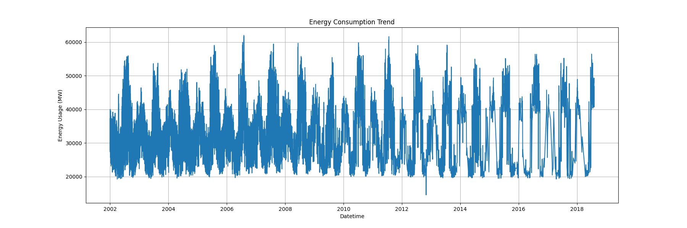
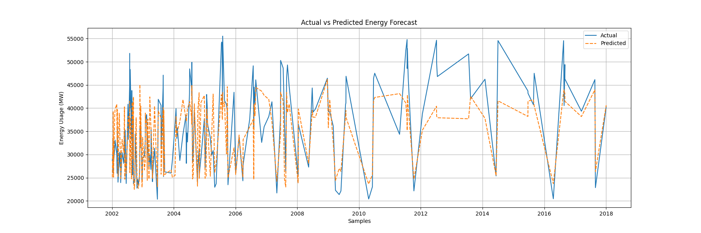

# AI-Powered Energy Consumption Forecasting System

## Overview

The **AI-Powered Energy Consumption Forecasting System** is an end-to-end Machine Learning project developed to forecast electricity consumption using historical energy usage data.

This project combines:

* Data Analysis
* Machine Learning
* Neural Networks
* Forecast Visualization
* Flask Backend API
* Streamlit Dashboard

The system analyzes historical electricity consumption patterns and predicts future energy demand using engineered time-series features and neural network-based forecasting.

The project simulates a real-world industry energy analytics platform used in:

* Smart Grids
* Electricity Boards
* Manufacturing Plants
* Data Centers
* Smart Buildings

---

# Problem Statement

Energy consumption is continuously increasing across industries and smart infrastructures.

Electricity providers and organizations often face challenges such as:

* Unbalanced energy demand
* Power wastage
* High operational costs
* Poor load planning
* Difficulty predicting peak consumption periods

Traditional systems struggle to efficiently forecast future electricity usage patterns.

This project solves that problem by building an AI-based forecasting system that:

* analyzes historical energy usage
* identifies patterns
* predicts future consumption
* helps optimize energy management

---

# Industry Relevance

This project is highly relevant in modern industries because forecasting electricity demand helps organizations:

* reduce operational costs
* improve power distribution
* avoid energy shortages
* optimize smart grid systems
* manage electricity demand efficiently

### Real-World Use Cases

* Smart City Energy Analytics
* Electricity Demand Forecasting
* Industrial Load Forecasting
* Renewable Energy Planning
* Consumer Electricity Bill Estimation
* Data Center Power Optimization

---

# Tech Stack

## Programming Language

* Python

## Libraries & Frameworks

* Pandas
* NumPy
* Matplotlib
* Seaborn
* Scikit-learn
* Flask
* Streamlit
* Joblib

## Machine Learning Model

* MLPRegressor (Neural Network)

## Visualization Tools

* Matplotlib
* Streamlit Dashboard

## Backend

* Flask API

---

# Dataset

The project uses publicly available historical energy consumption datasets.

### Dataset Used

* PJME Hourly Energy Consumption Dataset

### Dataset Features

| Column   | Description                     |
| -------- | ------------------------------- |
| Datetime | Timestamp of electricity usage  |
| PJME_MW  | Energy consumption in Megawatts |

### Dataset Characteristics

* Hourly time-series data
* Historical electricity consumption
* Large-scale real-world energy dataset
* Suitable for forecasting applications

---

# Project Architecture

```text id="read001"
Historical Energy Dataset
            ↓
Data Preprocessing
            ↓
Feature Engineering
            ↓
Machine Learning Model Training
            ↓
Energy Consumption Forecasting
            ↓
Model Evaluation
            ↓
Flask Backend API
            ↓
Streamlit Interactive Dashboard
            ↓
Prediction & Analytics Visualization
```

---

# End-to-End ML Pipeline

## 1. Data Collection

Historical electricity usage data is collected from publicly available energy datasets.

## 2. Data Preprocessing

The dataset is cleaned and converted into time-series format.

Tasks performed:

* Datetime conversion
* Missing value handling
* Duplicate removal
* Time indexing

## 3. Feature Engineering

Time-based features are extracted:

* Hour
* Day of Week
* Month
* Year
* Lag Features

## 4. Model Training

A Neural Network Regression model (`MLPRegressor`) is trained using historical energy consumption patterns.

## 5. Forecast Prediction

The trained model predicts future electricity usage based on historical patterns.

## 6. Model Evaluation

The forecasting model is evaluated using:

* R² Score
* Mean Absolute Error (MAE)

## 7. Dashboard Visualization

Results are displayed using an interactive Streamlit dashboard.

---

# Dashboard Features

The Streamlit Dashboard provides:

* Historical Energy Trend Visualization
* Actual vs Predicted Forecast Graph
* Model Performance Metrics
* Interactive User Input Panel
* Real-Time Energy Prediction
* Consumer Electricity Bill Estimation

---

# Flask Backend API

The project also includes a Flask API backend that:

* loads the trained model
* accepts forecasting inputs
* returns AI-generated predictions

### API Endpoint

```text id="read002"
/predict
```

### API Output Example

```json id="read003"
{
   "Predicted Energy Usage": 25543.67
}
```

---

# Installation

## Clone Repository

```bash id="read004"
git clone https://github.com/Shravani123576/AI-Energy-Forecasting-System.git
```

---

## Navigate to Project Directory

```bash id="read005"
cd AI-Energy-Forecasting-System
```

---

## Create Virtual Environment

### Windows

```bash id="read006"
python -m venv venv
```

### Activate Environment

```bash id="read007"
venv\Scripts\activate
```

---

## Install Dependencies

```bash id="read008"
python -m pip install -r requirements.txt
```

---

# Usage

## Run Streamlit Dashboard

```bash id="read009"
streamlit run dashboard.py
```

Dashboard URL:

```text id="read010"
http://localhost:8501
```

---

## Run Flask API

```bash id="read011"
python app.py
```

API URL:

```text id="read012"
http://127.0.0.1:5000
```

---

## Test API

```bash id="read013"
python test_api.py
```

---

# Results

## Model Performance Metrics

* R² Score: ~0.90+
* MAE: Reduced using lag feature engineering

## Forecasting Capability

The model successfully learns:

* hourly consumption patterns
* weekly energy behavior
* seasonal electricity trends

## Dashboard Outputs

* Energy Consumption Trends
* Actual vs Predicted Visualization
* Energy Usage Forecast
* Bill Estimation

---

# Screenshots

## Dashboard Preview

Add dashboard screenshot here.

```markdown id="read014"

```

---

## Energy Consumption Trend

```markdown id="read015"

```

---

## Actual vs Predicted Graph

```markdown id="read016"

```

---

# Learning Outcomes

Through this project, the following concepts were learned and implemented:

## Machine Learning

* Regression Modeling
* Neural Networks
* Forecasting Systems
* Model Evaluation

## Data Science

* Data Cleaning
* Time-Series Analysis
* Feature Engineering
* Visualization

## Backend Development

* Flask API Development
* JSON Communication
* Model Deployment Workflow

## Dashboard Development

* Streamlit UI
* Interactive Analytics
* Real-Time Prediction System

## Software Engineering

* End-to-End ML Pipeline
* GitHub Project Structuring
* Virtual Environment Management
* Industry-Style Workflow

---

# Future Improvements

Future enhancements can include:

* Weather-based forecasting
* Real-time IoT sensor integration
* Deep Learning models (LSTM)
* Cloud Deployment
* Smart Grid Integration
* Advanced Analytics Dashboard

---

# Conclusion

This project demonstrates a complete end-to-end AI forecasting workflow for energy analytics.

The system combines:

* Machine Learning
* Forecasting
* API Development
* Interactive Dashboard
* Business Analytics

to simulate a realistic industry-oriented energy prediction platform.

This project can be extended for:

* Smart Cities
* Industrial Energy Analytics
* Consumer Bill Prediction
* Renewable Energy Forecasting
* Intelligent Energy Optimization Systems
